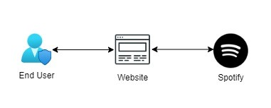
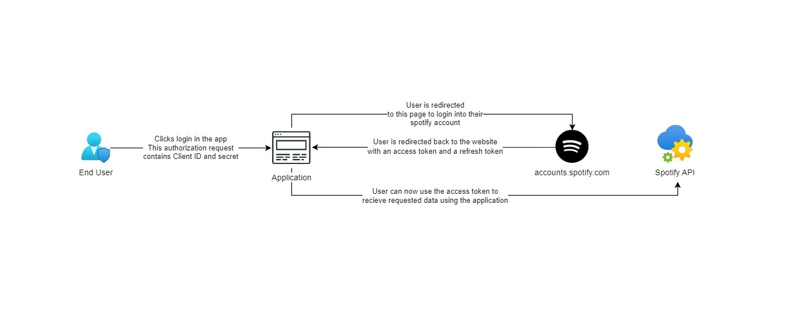

## Spotify's Authorization
> OAuth (Open Authorization) is a secure, industry-standard protocol that allows you to approve one application interacting with another on your behalf without giving away your password. Instead of passing user credentials from app to app, OAuth lets you pass authorization between apps over HTTPS with access tokens (kind of like a special code).

In this application we have 3 main actors
- **End User** corresponds to the Spotify user. The End User grants access to the protected resources (e.g. playlists, personal information, etc.)
- **My App** is the client that requests access to the protected resources (e.g. a mobile or web app).
- **Server** which hosts the protected resources and provides authentication and authorization via OAuth 2.0.

|  |
| :---------------------------------------: |
|        *Actors of the application*        |

## Steps to establish OAuth
The five basic steps of the OAuth flow:
- Client requests authorization to access data from Spotify
- Spotify authorizes access to client
- User grants app access their Spotify data
- Client receives access token from Spotify
- Client uses access token to request data from Spotify

|    |
| :---------------------------------------: |
| *Architecture Diagram of the Application* |

## Spotify's Authorization Flow
According to Spotify's Authorization Guide, there are four possible flows for obtaining app authorization:
- Authorization Code Flow
- Authorization Code Flow With Proof Key for Code Exchange (PKCE)
- Implicit Grant Flow
- Client Credentials Flow

Each of these flows provides a slightly different level of authorization due to the way it is granted.

Out of all four of these flows, the **Authorization Code Flow** is the only one that lets the client access user resources, requires a server-side secret key (an extra layer of security), and provides an access token that can be refreshed. The ability to refresh an access token is a big advantage — users of our app will only need to grant permission once.

|  |
| :------------------------------------------------: |
|            *Spotify Authorization Flow*            |

