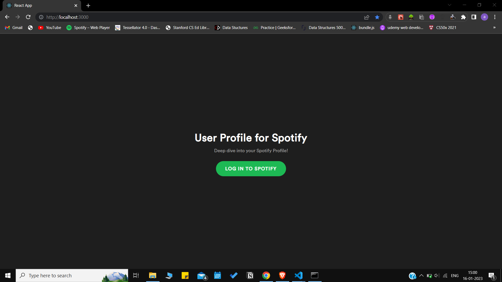
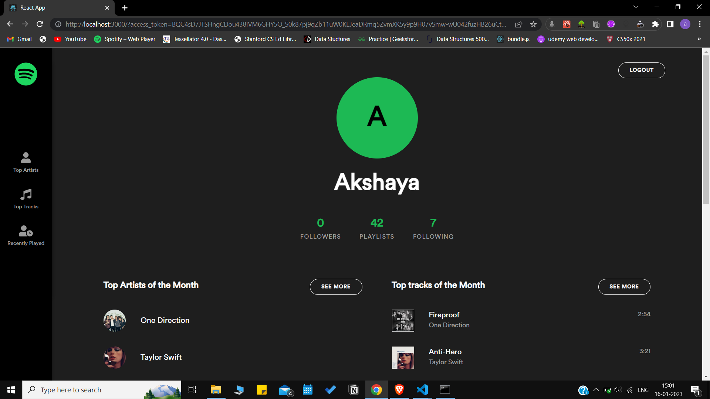
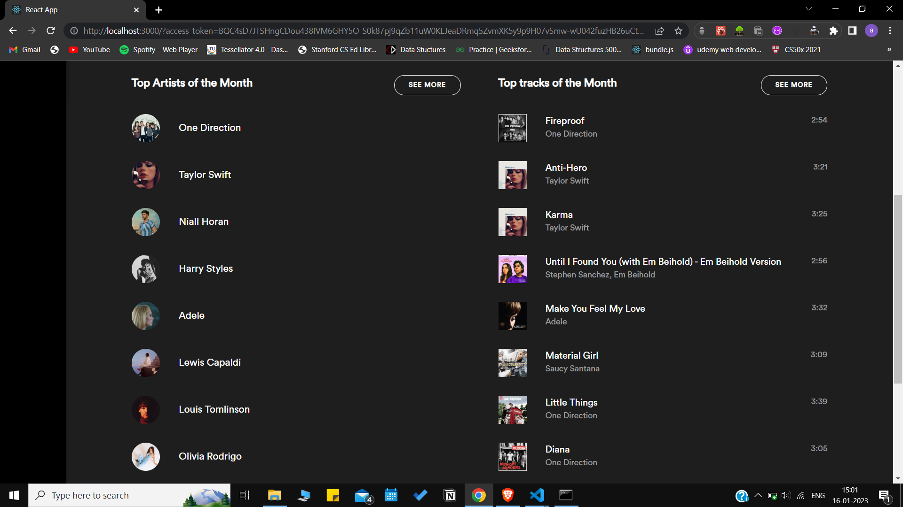
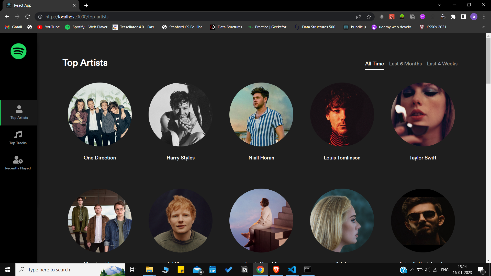
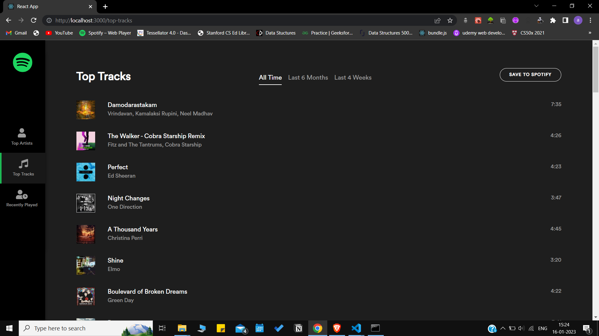
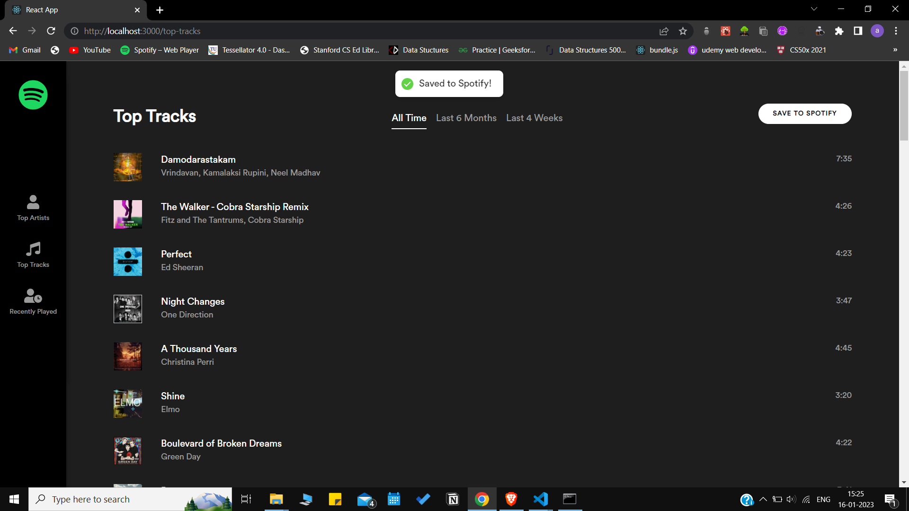
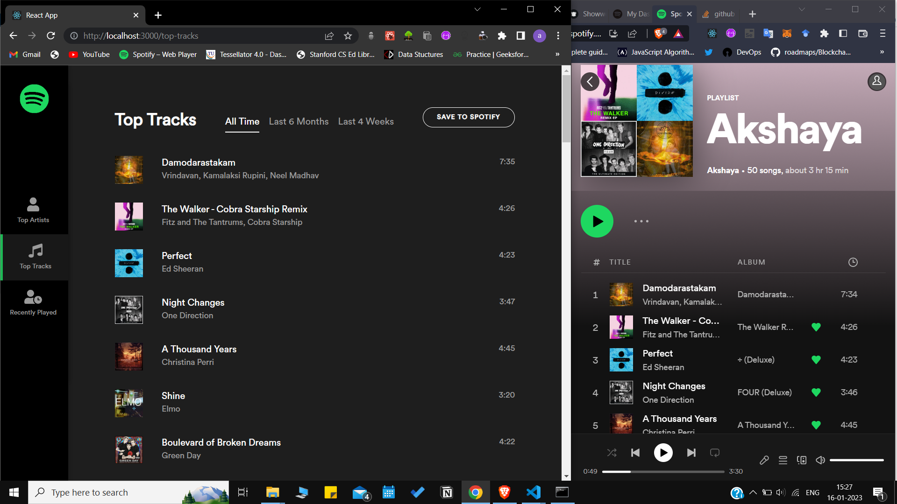
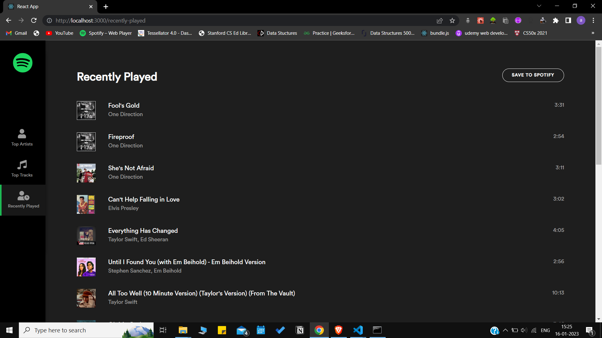
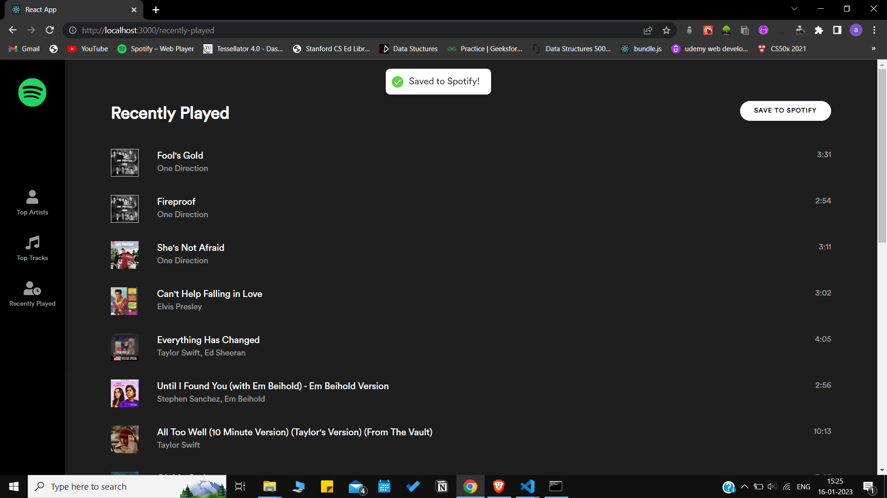
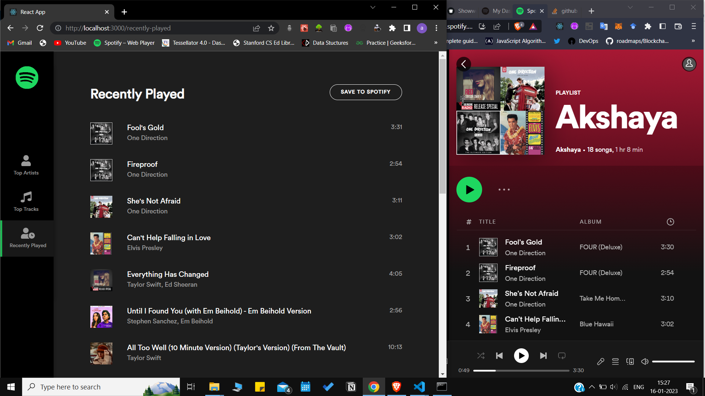

## Spotify User Profile
This application gives information about user's 
- Top Tracks
- Top Artists
- Recently Played Tracks

It also lets the user create playlists for Top Tracks and Recently Played Tracks that will be added to User's Spotify Account Directly.

## Clone this Project

### Spotify Developer Dashboard Setup
1. To test this application locally, you need to register your application on [Spotify Developer Dashboard](https://developer.spotify.com/dashboard/).
2. Create an app on the Developer Dashboard, you will be given **Client ID** and **Client Secret**
3. Upon achieving these, make sure you store these details somewhere as they would be further used in the application.

### Setting up the project locally

1. Clone the Project
2. Create a `.env` file in the root directory of the Project
3. In the .env file,
    - Create 4 Keys
    - `CLIENT_ID`, `CLIENT_SECRET`, `REDIRECT_URI`, `FRONTEND_URI`
    - Add the Client ID and Client Secret details here that we obtained from the developer dashboard.
4. `npm install`
5. `npm start`

## Note

Spotify recently introduced new changes to their developer platform where new third-party apps are automatically placed in "development mode". In development mode, up to 25 users can use your app — these users must be explicitly added under the section "Users and Access" before they can authenticate with your app.

So if the user of the application is not registered with the app then a `403` error will be displayed saying `"User not registered in the Developer Dashboard"`

## Screenshots of the application

|  | 
|:--:| 
| *Login Screen* |
|  | 
| *Home Page 1* |
|  | 
| *Home Page 2* |
|  | 
| *Top Artists Page* |
|  | 
| *Top Tracks Page* |
|  | 
| *On clicking Save to Spotify, Top tracks playlist is created and saved to Spotify* |
|  | 
| *Top tracks playlist is created and saved to Spotify* |
|  | 
| *Recently Played Page* |
|  | 
| *On clicking Save to Spotify, Recently Played playlist is created and saved to Spotify* |
|  | 
| *Recently Played playlist is created and saved to Spotify* |